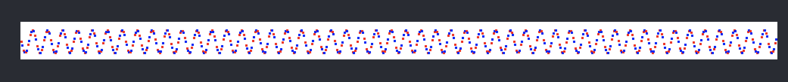

# ZLView
ZLView base react , super and sub  , coordinate by  x-y-width-height；基于react的视图，使用x-y-width-height坐标系


## 示例

绘制正弦曲线

<!--  -->

```ts

import React from 'react';
import * as zl from 'react-zlview'

class App extends React.Component
{
    private appView : zl.View | undefined;
    render()
    {
        if(this.appView === undefined)
        {
            this.appView = new zl.View();
            this.appView.x = 200;
            this.appView.y = 100;
            this.appView.width = 1000;
            this.appView.height = 50;
            this.appView.backgroudColor = "white";

            let colors = ["red","blue","gredd"];
            for (let i = 0 ; i < 999; i ++)
            {
                let sub = new zl.View();
                sub.x = i;
                sub.y = Math.sin(i / 3.14) * 15 + this.appView.height / 2;
                sub.width = 3;
                sub.height = 3;
                sub.backgroudColor = colors[i %3];
                this.appView.addSubview(sub);
            }
        }
        // 也可以直接返回 this.appView.reactElement();
        // return  this.appView.reactElement();
        return (
            <div className="App">
                <header className="App-header">
                    {this.appView.reactElement()}
                </header>
            </div>
        );
    }
}
```

## ZLView的坐标系统

一个ZLView对应一个`React Component`，也可说是对`React Component`的封装；ZLView采用固定CSS样式，将`position`设置为`absolute`，然后设置`left/right/widht/height`。当然ZLView对此作了封装：

| 属性     | 含义                                      |
| -------- | ----------------------------------------- |
| x        | 以父视图左上定点为原点的坐标系中，x轴位置 |
| y        | 以父视图左上定点为原点的坐标系中，y轴位置 |
| width    | 宽度                                      |
| height   | 高度                                      |
| left     | 同x                                       |
| right    | x+width                                   |
| top      | 同y                                       |
| bottom   | y+height                                  |
| center_x | (x+width)/2                               |
| center_y | (y+height)/2                              |
| center   | (center_x,center_y)                       |

### ZLView的尺寸单位

支持`px`和`rem`两种，默认使用`px`单位。
可以设置`ZLCurrentSizeUnit`值来改变尺寸单位。另外，px和rem的换算，默认使用`1rem=16px`，也可以修改`ZLCurrentSizeUnitOneRemToPx`来改变这个换算比例.

## ZLView的生命周期

源自React Component的生命周期

| 方法            | 含义                       |
| --------------- | -------------------------- |
| viewDidMount/addListenViewDidMount/removeListenViewDidMount    | React.componentDidMount    |
| viewWillUnmount/addListenViewWillUnMount/removeListenViewWillUnMount | React.componentWillUnmount |

## 父视图和子视图

 * `superView` 获取父视图
 * `removeFromSuperview` 从父图中移除
 * `subViews` 获取子视图列表
 * `addSubview` 添加子视图

 ## 刷新视图
 
 * `refresh` 刷新视图，本质是调用 React.setState。 ZLView的属性变更后，需要主动调用 `refresh`来刷新视图
 * `layoutSubViews`,是一个通知类型的方法，用于重新布局子视图列表；触发时机是在React.render返回结果前

## ZLView获取DOM节点

可以通过实现方法`onReactRefCallback`来获取，也可以调用`addListenOnReactRefCallback`添加新方法获取.

## 监听DOM事件
 
 通过`addListenDOMEvent`和`removeListenDOMEvent`可以监听/移除监听DOM事件，例如
 ```ts
 view.addListenDOMEvent("onClick", (e:React.SyntheticEvent)=>{
     console.log("clicked");
 })
 ```


## 继承ZLView

ZLView支持继承以自定义视图样式，通常需要重写的方法`__reactRender__`和`__htmlAttributes__`，前者用于返回React.render数据，后缀用于修改`CSS样式`

示列:
```ts
class CustomView extends zl.View
{
    /**
     * 渲染  React render
     */
    protected __reactRender__(children?:React.ReactNode[]) : React.ReactElement
    {
        // html attributes
        let attr = this.__htmlAttributes__();
        return React.createElement("canvas"/*自定义标签*/, attr.toReactClassAttributes(),children);
    }

    /**
     * 子类可重写
     * @returns html attributes
     */
    protected __htmlAttributes__() : ZLHtmlAttribute
    {
        let attr = super.__htmlAttributes__();
        attr.style.backgroundColor = "white";//背景色永远是白色
        return attr
    }
```


## Transform
封装了matrix2d和matrix3d变换`ZLTransform`，内部实现使用了矩阵乘法，支持`translate 平动`、`scale 缩放`、`rotate 旋转`、`skew 倾斜`、`refect 翻转`。

```ts
let view:zl.View = new zl.View();
view.width = 200;
view.height = 100;
view.backgroundColor = "yellow";

let transform = new zl.Transform();
transform.rotate(Math.PI);
transform.translate(10,190);
view.transform = transform;
view.refresh();
```

## 背景色、前景色、不透明度、是否可见、是否禁用

* `backgroundColor` 略
* `color`  略
* `opacity`  略
* `visibility`  略
* `disabled` 略

## 设置阴影

简单封装了`css box shadow`，可以直接设置`ZLView.boxShadow`属性
```ts
view.backgroundColor = "yellow";

let shadow = new zl.BoxShadow();
shadow.color = "green";
view.boxShadow = shadow;
```

## 边框
支持简单设置
* `borderColor` 边框颜色
* `borderStyle` 边框样式
* `borderWidth` 边框宽度


## 动画

简单封装了CSS动画，直接作用在ZLView上

```ts
/**
 * 开启一个3秒动画
 * 尺寸从(100,200)变化到（200，100）
 * 背景色从red到yellow
 * 动画曲线使用cubic-bezier（1,0,0,1)
 */

let view = new zl.View()
view.width = 100;
view.height = 200;
view.backgroudColor = "red";

view.cssAnimation({to:()=>{
            view.backgroudColor = "yellow";
            view.x = 100;
            view.width = 200;
            view.height = 100;
            
            let transform = new zl.Transform();
            transform.rotate(Math.PI);
            transform.translate(10,190);
        },
            duration:3000,
            timingFunction:zl.CSSAnimationTimingFunction.cubicBezier,
            cubicBezierValue:[1,0,0,1],
            end:()=>{
                console.log("animation end");
            }
});
```

## ZLRouter路由 

封装`react-router-dom`。引入页面概念`ZLViewPage`，一个路由对应一个页面，采用严格模式匹配路由的`path`

```ts
class HomePage extends zl.ViewPage
{
    viewDidLoad()
    {
        super.viewDidLoad();
        this.view.backgroudColor = "red";
    }

    viewDidMount()
    {
        setTimeout(()=>{
            this.router?.push("/other");
        },5000);
        console.log( this.constructor.name + " mount");
    }

    viewWillUnmount()
    {
        console.log( this.constructor.name + " unmount");
    }
}

class OtherPage extends zl.ViewPage
{
    viewDidLoad()
    {
        super.viewDidLoad();
        this.view.backgroudColor = "blue";
    }

    viewDidMount()
    {
        console.log( this.constructor.name + " mount");
    }

    viewWillUnmount()
    {
        console.log( this.constructor.name + " unmount");
    }
}

class App extends React.Component
{
    private router: zl.Router | undefined;
    render()
    {
        if (this.router === undefined) {
            this.router = new zl.Router();
            this.router.registRoute("/",HomePage);
            this.router.registRoute("/other", OtherPage);
        }
        return this.router.reactElement();
    }
}
 ```
### 注册路由

```ts
let router = new zl.Router();
router.registRoute("/",HomePage);
router.registRoute("/other",OtherPage);
```

也可以直接注册`ZLViewPage`
```ts
// 等同于  router.registRoute("/OtherPage",OtherPage);
router.registViewPage(OtherPage);
```

### 路由跳转

```ts
router.push("/other");
router.replace("/");
```

也可以直接push`ZLViewPage`
```ts
// 等同于  router.push("/OtherPage");
router.pushViewPage(OtherPage);
```


## 更新日志

### 0.1.0
* 使用x-y-width-height坐标系统
* 支持px/rem两种单位
* 方便管理子视图添加和移除的操作
* 使用矩阵乘法，支持transform2d/3d
* 支持dom事件监听
* 支持简单css动画
* 封装了路由的基本操作，可在运行时更新路由

### 0.1.1
* 重写ZLList和ZLReadOnlyList的实现
* ZLEventCallbackList使用WeakRef存储thisArg
* 修复ZLCSSAnimation在含有perspective时，生成tansform字符串格式错误。
* 修复ZLView的tansform style样式字符串格式错误
* 增加ZLSlider（封装input type="range"）
* 增加ZLCheckBox（封装input type="checkbox"）
* 增加ZLRadioButton（封装input type="radio"）

### 0.2.0
* 增加对css transition的支持
* 修复ZLList的protoltype问题 https://github.com/Microsoft/TypeScript/wiki/FAQ#why-doesnt-extending-built-ins-like-error-array-and-map-work
